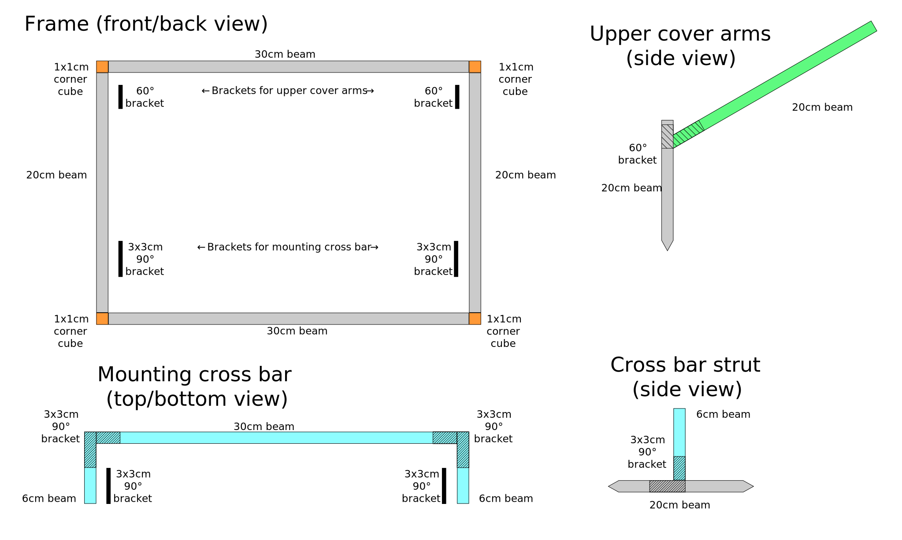

# iPad Stand Sun Shade

_by Dave Plummer and Rob Wells_

One of us ([Dave Plummer](https://www.facebook.com/dave.plummer.sax/)) uses an iPad on a stand while playing at events. However, in sunlight the iPad can overheat and shut down. We set out to design a structure that could be attached to the stand, covered with some kind of material, and shield the iPad from sunlight.

We made the structure out of the [MakerBeam][] brand of 10mm extruded aluminium because we had it available, but there's no reason why you couldn't make something of the same or similar design out of other materials.

The links below go to the UK distributor of MakerBeam products, Technobots; if you live elsewhere see the [official MakerBeam website][official] for purchase information.

[MakerBeam]: https://www.technobotsonline.com/makerbeam.html
[official]: https://www.makerbeam.com/

## Parts list

- 4 × [200mm beam](https://www.technobotsonline.com/makerbeam-200mm-long-black-anodised-beam-threaded.html)
- 3 × [300mm beam](https://www.technobotsonline.com/makerbeam-300mm-long-black-anodised-beam-threaded.html)
- 2 × [60mm beam](https://www.technobotsonline.com/makerbeam-60mm-long-black-anodised-beam-threaded.html)
- 4 × [10x10mm corner cube](https://www.technobotsonline.com/makerbeam-corner-cube-kit-in-black-pack-of-12-with-hex-key.html)
- 4 × [30x30mm 90° bracket](https://www.technobotsonline.com/makerbeam-equal-right-angle-bracket.html)
- 2 × [60° bracket](https://www.technobotsonline.com/makerbeam-60-degree-angle-bracket.html)
- [M3 square-head bolts](https://www.technobotsonline.com/makerbeam-m3-square-head-set-bolts-x-6mm-pack-of-250.html)
- [M3 nuts](https://www.technobotsonline.com/makerbeam-m3-stainless-steel-plain-nuts-of-250.html)
- [M3 T-slot nuts](https://www.technobotsonline.com/makerbeam-t-slot-nut-set-pack-of-25-with-hex-key.html)
- M3 flat-head countersunk bolts (supplied with corner cubes)

## Instructions

Because of the way the bolts slide into the centre of the beams, you'll want to work "inside-out", attaching the brackets before forming larger pieces.

Use 2 200mm beams to form the vertical sides of the main frame, attach a 60° bracket to the top of the inside of each, and a 90° bracket to the bottom of the inside of each.

Attach a 200mm beam to each of the 60° brackets. These can be placed either on the inside or outside of the brackets, giving either a 30cm or a 32cm width for the top cover respectively.

Take 1 300mm beam and attach the 2 60mm beams to it at right angles with 90° brackets. Attach this piece in turn to the 90° brackets on the vertical 200mm beams.

Take the remaining 2 300mm beams and attach corner cubes at each end. Then attach the corner cubes to the vertical 200mm beams, to form a 32cm by 22cm rectangle.

The structure of the shade is now complete.

## Mounting to your stand

How you will mount the shade to your iPad stand will depend on the stand itself. We used a normal 5mm-thick L-shaped steel bracket, with a hole drilled in one leg to fit the adjustment bolt on the side of the stand just below the iPad holder itself. The bracket is fitted so that it extends forward from the stand (as you look at it as if you were playing), and then the other leg extends horizontally across the front of the stand.

This front leg of the bracket can be drilled to accommodate the M3 bolts from the MakerBeam set. To attach the L-shaped bracket to the shade structure, slide the T-slot nuts into the channel of the 300mm cross-bar that faces towards your iPad stand. Push the bolts through the L-shaped bracket and tighten into the T-slot nuts in the cross-bar.

It may be that a more solid attachment is needed; this works but time will tell if it's secure enough.

## Covering the shade

The front rectangle of the shade is 32cm wide by 22cm tall. The top cover is either 32cm or 30cm wide, depending on whether you mounted the arms to the inside or outside of the 60° brackets. The top cover does not need to be any particular length, but we've gone for 20cm.

There are several UK manufacturers that will supply you with plastic cut to any given size, or you may want to use another material, such as plywood. There are also several companies that will produce hard-wearing vinyl stickers of a matching size to attach to the front, so that you can display your name and contact details, or whatever else.

